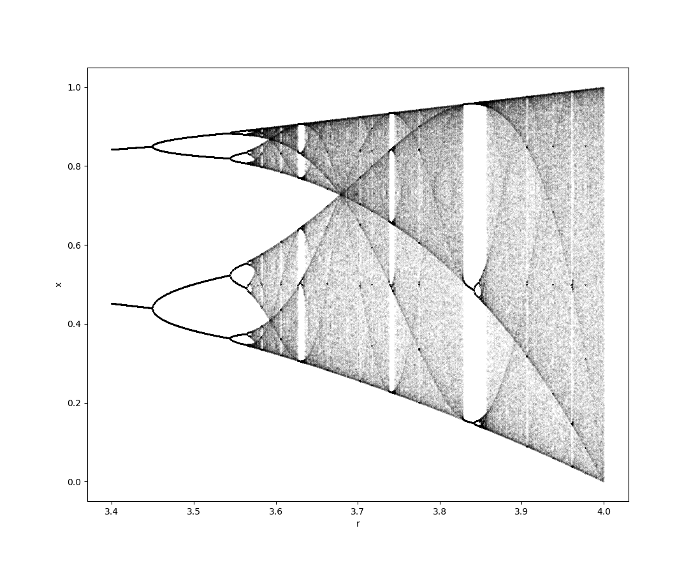

# Logistic Map
This code plots a bifurcation diagram of logistic map described below.
```math
x_{n+1} = rx_n(1-x_n)
```
This is one of the famous examples of chaos and fractal. [^1]
## Requirements
```
numpy, matplotlib, tqdm
```
## Bifurcation diagram



[^1]:Strogatz, S. H. (2018). Nonlinear dynamics and chaos: with applications to physics, biology, chemistry, and engineering. CRC press.
